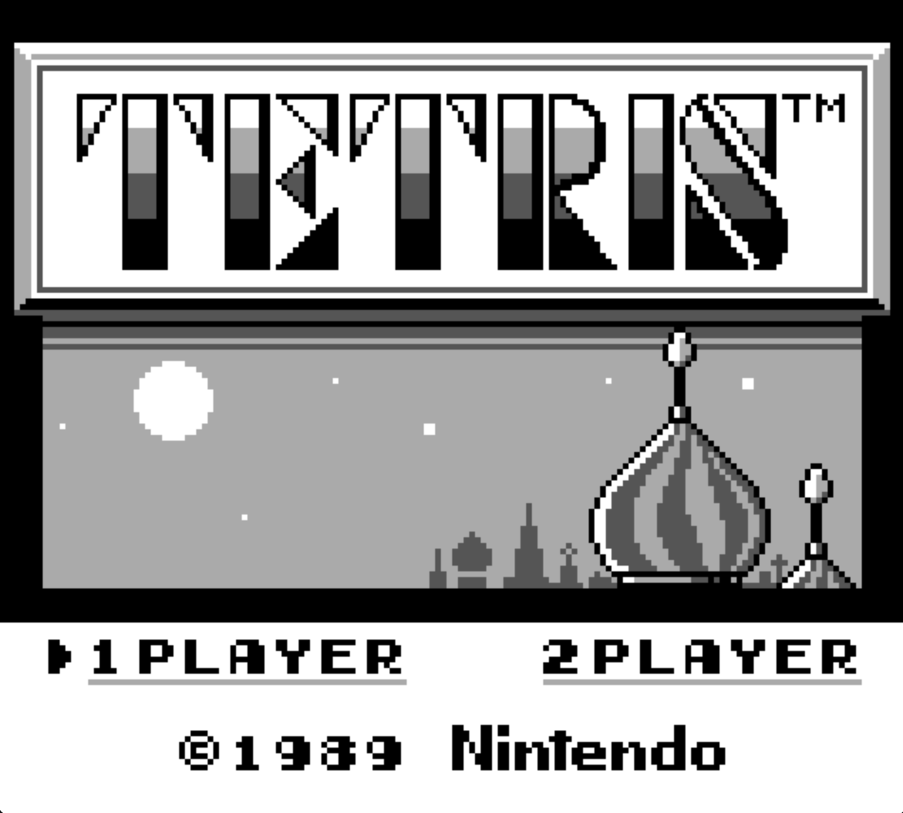

# Game Boy Emulator
Hello all, this here is a Game Boy emulator that I am currently working on for MacOS.  
I am using [Pan Docs](https://gbdev.io/pandocs/Memory_Map.html) for all the hardware information.  

---

It is done! The gameboy emulator runs most gameboy and gameboy color games.  
It has a working save system and sound system.  
The controls and setup are described below.  

---

This was a really fun and rewarding project.  
It took around a month of time and around 6500 lines of code, by far the longest and hardest project I have done to date.  
There were so many annoying bugs that were such an easy fix but took so long to find.  
For instance, I was missing some memory write code so the emulator was unable to write to the cartridge RAM which broke the entire thing.  
Another bug had to do with signed and unsigned ints and the size of ints in the GPU, that took so long to find but was such a simple fix.  
All in all, I'm glad I worked on this and I learned a lot.  
I probably won't make another emulator, at least for a while, but this was a very fulfilling project as at the end of it I have something tangible to show for it.  
I learned A LOT about emulation, especially graphics and audio.  

## Setup

- Clone the repo  
```bash
git clone https://github.com/aidanvidal/Game-Boy-Emulator.git
cd Game-Boy-Emulator
```

- Run A Make Command  
```bash
make gameboy
```

- Then get a ROM and play  
```bash
./gameboy filename.rom screen_multiplier(optional)
```

## Controls

Arrow Keys for movement  

| Game Boy Button | Computer Key |
|------------------|--------------|
| A                | Z            |
| B                | X            |
| Select           | Enter        |
| Start            | Space        |

## Images

  
  
  

## Extra Info

For more information about Game Boy development and emulation, check out [GBDev](https://gbdev.io/).  
APU blog post - [here](https://aidanvidal.github.io/posts/GameBoy_Dev_APU.html)  
GPU blog post - [here](https://aidanvidal.github.io/posts/GameBoy_Dev_GPU.html)  
CPU and MBC blog post - [here](https://aidanvidal.github.io/posts/GameBoy_Dev_Final.html)
